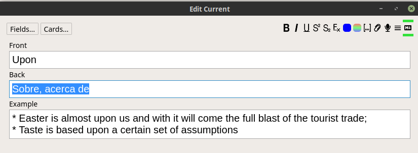

# Anki Markdown Formatter

TLDR; Surround your content with `<amd>` to have it processed as Markdown. There are some customizations/configurations below...

[If you already know Markdown, skip the next paragraph...]  

Markdown is an easy way of formatting texts, based on a predefined syntax. 
It makes it simple and fast to write texts because the user doesn't need to worry about annoying details, like when you user tool like Word. 
It's like on WhatsApp, you write \_text_ and after sending it, its shown as _text_.  

Check more information and the syntax out on the following websites:  

* [markdownguide](https://www.markdownguide.org/)
    * [Syntax](https://www.markdownguide.org/basic-syntax/)
* [commonmark.org](https://commonmark.org/help/)

And many other website...

**This addon** makes it possible to interpret cards (or parts of them) as Markdown.  
While editing or adding cards, write it in plain text. No formatting is done in this view.  
Then, when reviewing the card, it is interpreted as markdown and converted to formatted text (HTML actually).


## Usage

Markdown-formatter won't process everything. Therefore, you need to identify the area(s) that it should work on.  
This is done using a markup tag: `<amd>`.  

On the HTML code, put the tags `<amd>` and `</amd>` around the area to be processed.  

**Example:**  

        <amd>{{Example}}</amd>

This might be done either in the Card Type (Note) level or in parts of a given card. 

### Format the entire card type

This is done through Card Type Configuration. Thus, it's applied to all cards of that type.  


### Format part of a card

In the editor, you can either use the Markdown button in the toolbar or use the shortcut.  
The default **shorcut** is *Ctrl+Shift+M* (may be changed in Configurations).  

Just **select the block** to be processed, then use one of the options.



### Pre-processing

Some handling needs to be done in the content before processing it as Markdown.  This happens duo to the way Anki stores the content (as HTML).

#### Trim lines

* Needed duo to ListItem, headers, blockquotes, etc
* Problem for codes

### Replace escaped spaces

* \&nbsp; vs simple space...


## Configuration

There are two configuration available. Both of them targeted to the editor:  

* Shortcut
    * As it says... shortcut for adding tags around selected text
* Show markdown button
    * Indicates whether the Markdown button shoud be shown or not
* Trim
    * Indicates whether each line should be trimmed
* Replace-spaces
    * Indicates whether it should replace escaped HTML spaces (\&nbsp;)


### Limitations:

#### Code block by space/tab

Code block started only by space or tab does not work. You need to wrap codes with \```.  

#### Careful with \&nbsp;

Anki uses HTML in you text. Therefore, some spaces are replaced by \&nbsp. 
If you are getting misformatted markdown, this might be the cause. Be aware!

* ...

## Bugs / Suggestions / more...

Please, feel free to make suggestions and open issues about possible bugs found.  

That and the source code are available on: [Github](https://github.com/ssricardo/anki-plugins/tree/master/anki-markdown)

## Updates

24/10/2018: **version 2.1**:

* Support for *trim* and *replace-spaces* configuration, both globally and locally
* Config renamed: showMdButton -> show-md-button

## About

Addon developed by *ssricardo*.  
Check out more of my addons on [https://github.com/ssricardo/anki-plugins]()