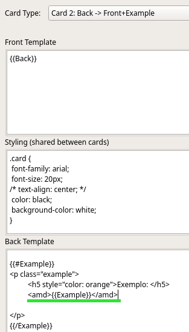
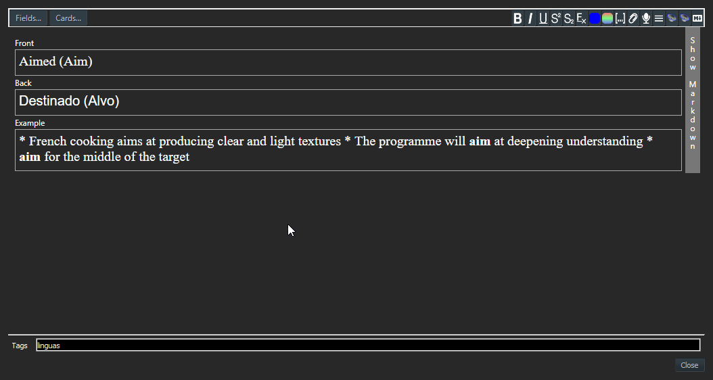
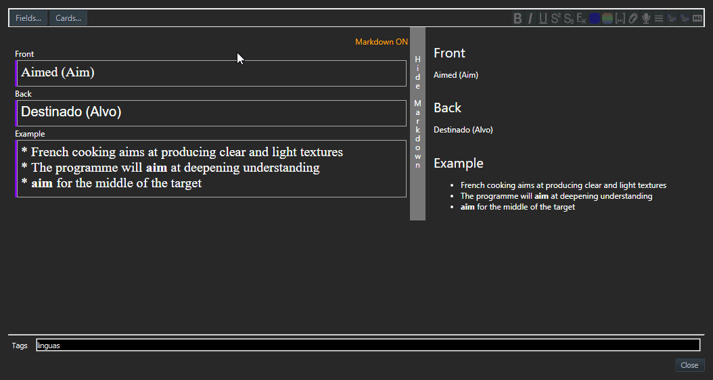
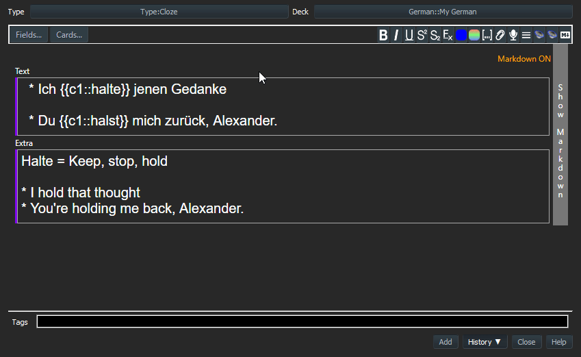

# Markdown Support

> TLDR; Surround your content with `<amd>` to let it be processed as Markdown. No conversion needs to be done in the editor (you can if you want though).  
> Or use the context menu to convert it in-place

> If you don't know Markdown, checkout below (in the end)

**This add-on** makes it possible to process cards' content (or parts of it) as Markdown.  
While editing or adding cards, write it in plain text. No formatting is required in this view.  
Then, when reviewing the card, it is interpreted as markdown and converted to HTML.

Other option is to convert the content in-place during the edition, either getting a clean text or producing HTML.  
These operations may also be executed in batch.  

## Usage

You need to identify the area(s) on the cards that the add-on should work on.  
This is done using a markup tag: `<amd>`.  

On the HTML code, put the tags `<amd>` and `</amd>` around the area to be processed.  

**Example:**  

        <amd>{{Example}}</amd>

This might be done either in the Card Type level (recommended) or in parts of a given card (in cards' edition).  

> Markdown-formatter won't process the entire card, only the delimited areas.  

The area being processed by this add-on will be shown with a purple left border.  

### Format the entire card type

This is done through Card Type Configuration. Thus, it's applied to all cards of that type.  

### Card Edition

In the editor there is a button *Markdown* to activate/deactivate the **Markdown mode**.  
When enabled this will *tell* Anki that the text being edited is pre-formatted and should not be *escaped*. Otherwise, Anki converts the text to HTML (For instance, line breaks become ` ` tags).  
The default **shorcut** is *Ctrl+Shift+K* (may be changed in Configurations).  

This won't convert the Markdown to HTML yet!

While editing, it's also possible to check the Markdown being produced using the *Preview*:  

> From version 2.3

### The conversion

There are 2 modes to make the add-on convert the content:

#### In runtime

Just write the notes using plain text (with Markdown formatting, of course).  
Then, during the review, the areas surrounded by `<amd>` will be converted and shown as HTML (it won't be stored as HTML).  

#### In place

> From version 2.x

In the editor, use the context menu (right click) to invoke the processing immediately.  There are 2 options:

* Convert to MD
  * Used to clean up existing formatting in the card, preparing it to be used as Markdown
* Convert to HTML
  * Interprets the content as Markdown and produces HTML (replacing the content)
  * May be used if you'd like to edit as Markdown, but you prefer to store as HTML

The other option on this menu is to wrap the selected content with `<amd>`.  

The default **shorcut** to show the menu is *Ctrl+Shift+M*.  

#### Pasting data

> From version 2.2

In the editor, if the Markdown mode is *On*, when pasting some data, it will be set as plain text. This prevents Anki default behavior (which converts the data to HTML).

### Batch

> From version 2.0

It is possible to invoke the conversion for several notes at once.  
This is useful in cases like: 

* When you start using this add-on and need to clean up the HTML existing in your collection (Convert to MD)
* When you use your cards on Anki Mobile and need them in HTML (Convert to HTML)

The batch operation are available on:  

> *Browse* -> *Notes* Menu -> *Markdown Addon*

> You need to select the cards you want to apply the conversion

## Configuration

The following customization are available:  

* Shortcut Edit
    * In the editor, it used to activate/deactivate the Markdown mode
* Shortcut Menu
    * In the editor, invokes the Markdown context menu
* Show markdown button
    * Indicates whether the Markdown button should be shown or not
* Enable preview
    * In the editor, should the preview be shown or not?

> further old configuration was dropped

> The shortcuts work only when the focus is into an input field

## Bugs / Suggestions / more...

Please, feel free to make suggestions and open issues about possible bugs found.  

That and the source code are available on: [Github](https://github.com/ssricardo/anki-plugins/tree/master/anki-markdown)

## Updates

> Check [RELEASE_NOTES]()

## About

Add-on developed by *ssricardo*.  
Check out more of my add-ons on [https://github.com/ssricardo/anki-plugins]()

## Still learning about Markdown...

Markdown is an easy way of formatting texts, based on a predefined syntax.  
It makes it simple and fast to write texts because the user doesn't need to worry about annoying details, like when you use tools like Word.  
It's like on WhatsApp, you write \_text_ and after sending it, its shown as _text_.  

Check out more information and the syntax on the following websites:  

* [markdownguide](https://www.markdownguide.org/)
    * [Syntax](https://www.markdownguide.org/basic-syntax/)
* [commonmark.org](https://commonmark.org/help/)

And many other websites...