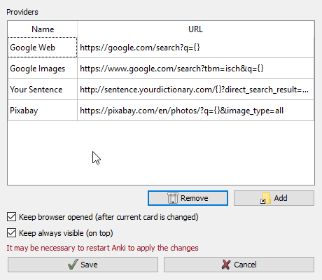
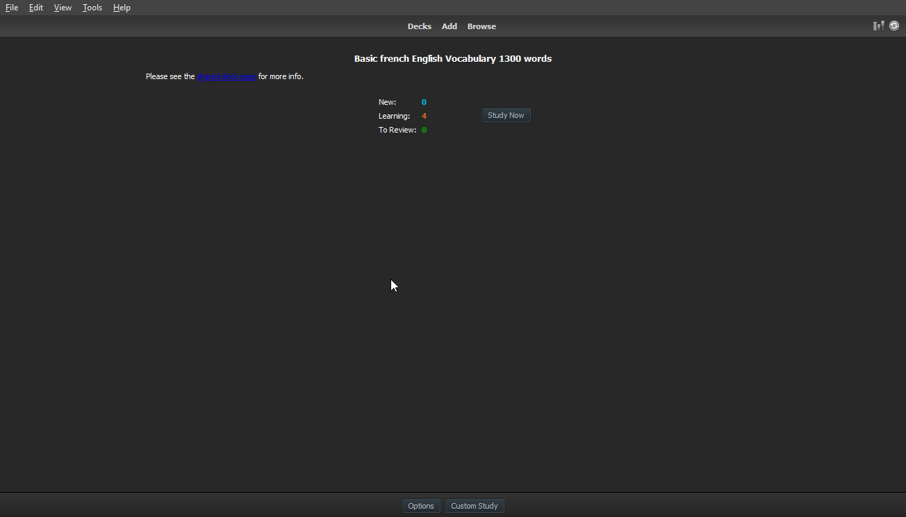
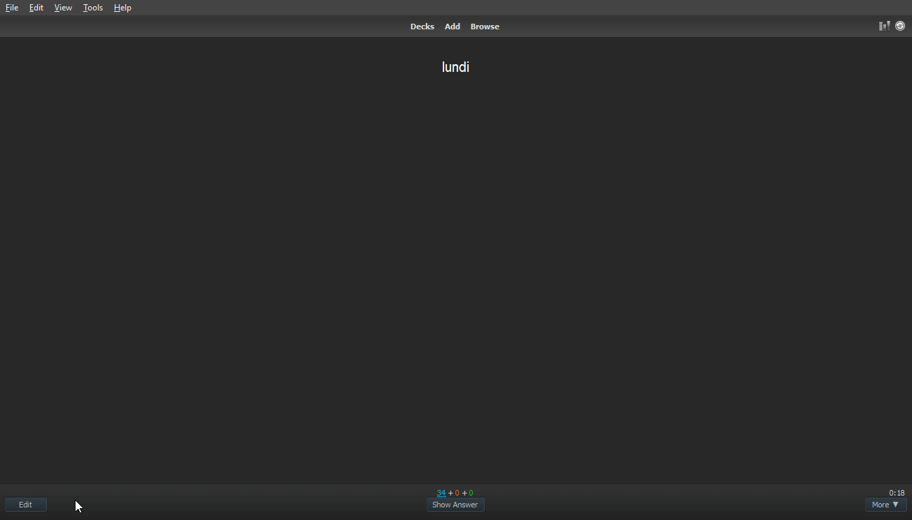

# Anki Web Browser

The **Anki Web Browser** is simply an Internet Browser within Anki (as the name suggests).  
It aims to make it simple when you are studying or editing a card and want to look something up in the internet.  

For instance, you are studying a foreign language and suddenly there is a word which you haven't understant properlly. In such case it's common to shift to the web browser and make search for the term there. 
This addon makes this task smoother.  

Therefore, this addon provides 2 functionalities:  

* Search the selected text in a website
* Import text and images directly from a website to a given card

## Configuration

In order to search something in a website, the user is given a list of registered websites to choose from. This list is called **providers**.  
In the Configurations view, the user may specify the providers he wants.  

The *web browser* may close itself the user shifts cards, that is, when a new card is shown as opposed to the one which was used for a query.  
This feature may be *enabled* or *disabled* using the configuration **Keep card opened**.  

The config **Always on top** is intuitive. It means that if enabled, when the *web browser* is shown, it remains above everything. This might be useful when editiing several notes.  

## Using

The functions of this addons are accessed through the context menu (either *right click* on mouse or *right menu key* on the keyboard).

### Search selected text

While studying or editing a given card:  

* Select a word or sentence
* Right click
* *Search in Web*
* Select the desired provider

Then a new window with the *web browser* will be opened, if it isn't opened yet.  

This feature is similar to another Anki addon. The difference is that in this one the user can use it with several sites and (the main advantage) you don't need to shift to your Internet browser and back to Anki again.  

### Get data directly from the web browser

When using this addon while adding or editing a note, it's possible to get text and images from the opened website to the card.  

After the look something up with the previous steps (above), on the *web browser*:  

* Select some text and then *right click* OR just *right click* over an image
* *Assign to field*
* A list with the fields from the source card is shown
* Choose one of them

This way, the text or image will be appended to the selected field.  
Even the image! (It's downloaded and imported into the collection automatically)

This feature makes it really simple and fast to get some information from the Internet and build or improve your Anki's collection.  

## Anki 2.1 / Next steps

A version for Anki 2.1 will be released soon. From that version and on, all future versions will likely target Anki 2.1+.

## Bugs / Suggestions / more...

Please, feel free to make suggestions and open issues for possible bugs found. 

Some pages aren't opening in this browser and for other ones sometimes the user needs to reload it. This is a known bug and it will be handled in the next version.