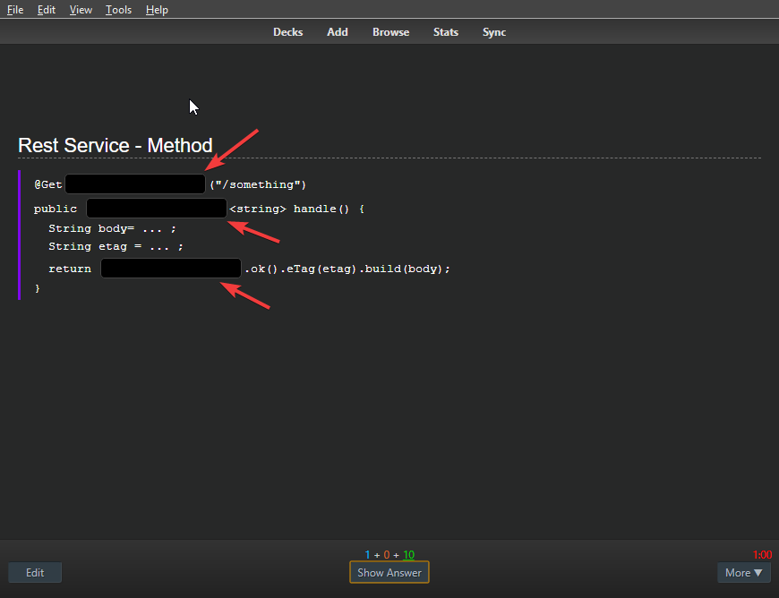
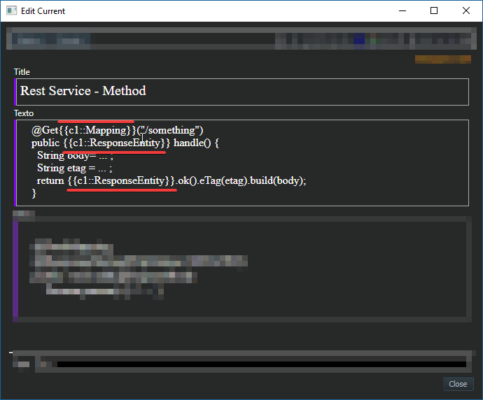
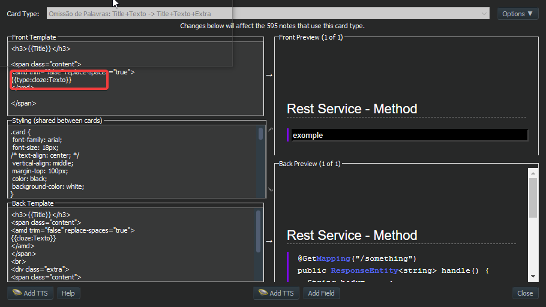
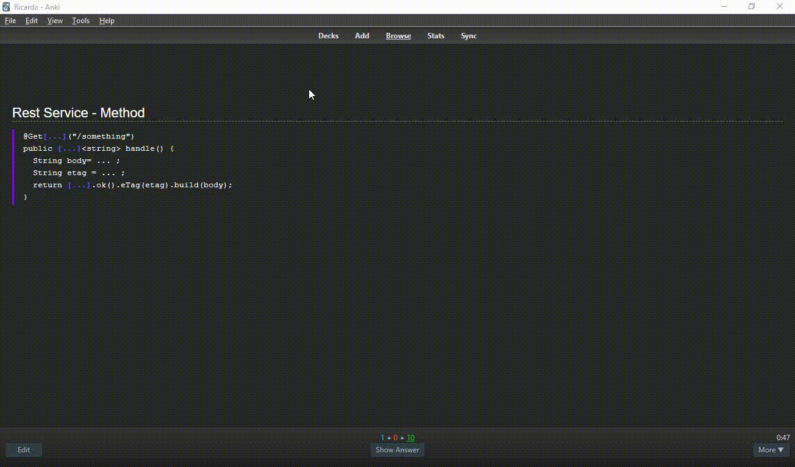
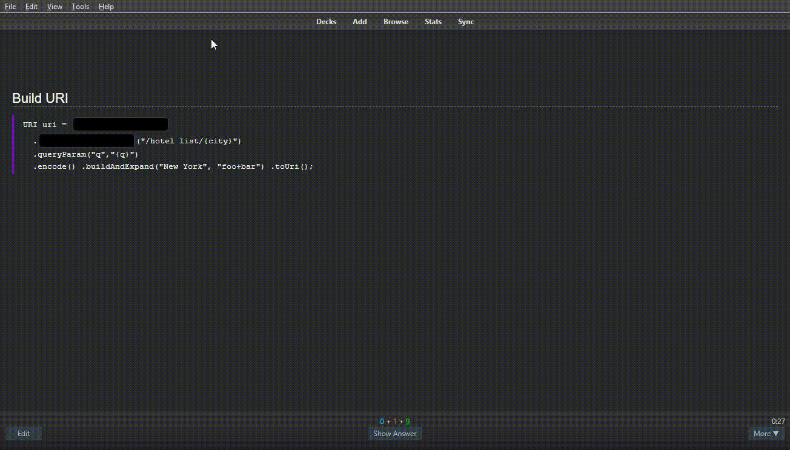

# Fill the blanks - Improved type:cloze

> *TLDR;*  
> This addons makes Anki handle cards of the kind *type:cloze* properly and adds support for multiple cloze parts on those cards

With the addon applied:  

## Motivation

Typing in the answers are interesting for studying. For many people, writing is more efficient for memorization than just reading.  
On cloze cards, when hiding just the cloze parts, it's possible to study contents within a context.  

The current version of Anki doesn't work well with that combination (On cloze card, it replaces the entire content with a single *input text*).  

This addon solves this issue.  

> Note from dev: At first, I'm using it for source code blocks. Soon, I think about using for cards with language (ex: German) phases as well

## How it works

* Create a card of type Cloze deletion

* On the note templates editor, instead of using *cloze:fieldName*, use *type:cloze:fieldName*

* Then, on review time, the cloze parts will be replaced with *input texts*

> Note: the images have a dark background because of the Night Mode addon (this behavior has nothing to do with the *Fill the blanks* addon)

## Extra feature

### Instant feedback

While the user types in the answer, the corresponding input field changes.  
The background color changes according to the value:  

* incomplete: yellow
* correct: green
* incorrect: red

> Note from dev: In my own tests, this is really good. It makes me try harder to get the right answer.

> Note 2: On the demonstration above, it's blue(or purple?) while typing in, but that was changed to yellow

## Bugs / Suggestions / more...

Please, feel free to make suggestions and open issues about possible bugs found.  

That and the source code are available on: [Github](https://github.com/ssricardo/anki-plugins/tree/master/fill-the-blanks)

## Updates

> Check [RELEASE_NOTES](RELEASE_NOTES.md)

## About

Add-on developed by *ssricardo*.  
Check out more of my add-ons on [Github Anki Plugins](https://github.com/ssricardo/anki-plugins)