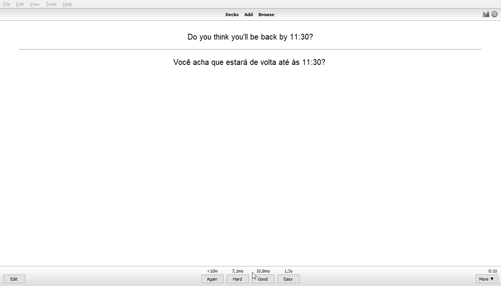
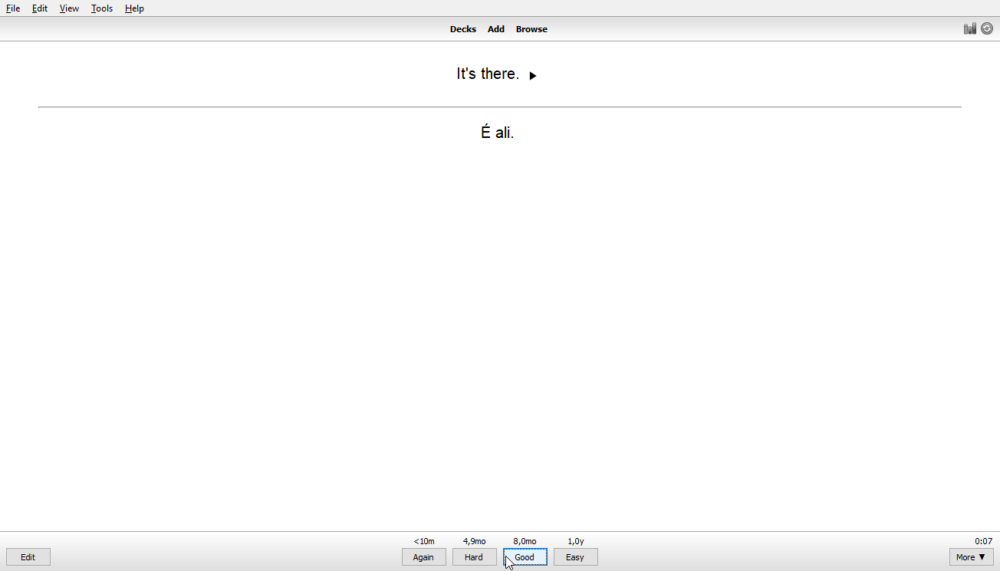

# Schedule Priority

The goal of this addon is to let you define different intervals for a set of cards in a deck.

Suppose you have a deck and you want to increase the interval when you mark a revision as good (for example).  
Currently you can do so, using Anki through *Deck Options*. Now, let's say you want to customize the interval for only a part of the cards. 
Through that *Deck Options* this is not possible tough, because it applies the options to the entire deck. 

## Customizing the intervals given by Anki

Having this feature could be interesting because in many times you want to use a customized interval.  
Even if you marked a given card as "good", sometimes you would like to review it again, before the provided time.  

It's possible to do it somehow with a few addons. For instance:   

* Define any custom time you want, with a shortcut that asks you what interval you want; 
* Lots of extra buttons with customized times, for each one.  

These options do work. They need you to manually choose the interval that you desire in each revision.  
As you have so many options (especially with those buttons), sometimes you are not sure about which one to use in that time.  

### Schedule Priority comes up

This addon modifies intervals based on the card (note) record. So when you are studying it, the time is assigned automatically. No need to think about this detail during the review. 

## How to use it

In the **edit** view, while either creating or editing the card, use the context menu (right click on mouse) and select one of the given options.

> Edit card -> Right click -> Card Priorization -> Click the choosen option

To make it easier and faster, it's also possible to use it during the **review**: 

### Using the keyboard

You can use the keys:

"Context menu" key -> C -> The option's number

## How it works

Basically, when you select to assign "High", "Highest", "Low" or "Lowest" priority, this addon uses the card's tags to save this information.
The following tags are related to this addon:

* priority:lowest
* priority:low
* priority:high
* priority:highest

When a "normal" priority is selected, both of those tags are removed from the card. Therefore, the standard priority is "normal" (of course, right?!).

Throughout the review, when a given card is loaded, this addon checks whether there is any of those tags or not. Then modify the card's *next times*, based on which of those tags is present (or none of them: do nothing).

## How to customize it

To customize this add-on, open up:

> Tools -> Add-ons -> schedule-priority -> Config...

In the current version, it is possible to modify:

* **Multiplier** value for each priority

Multiplier value is expressed as percentage.  
Consider that a *normal priority* card uses the same intervals as assigned by Anki. This means, 100% of the value calculated by Anki.   

High priority means that it must be repeated in shorter time. Therefore, it should be less than 100% (compared to the time got from Anki).  
Conversely, Low priority should not be repeat as much as other (meaning longer intervals). Thus, its intervals must be above 100%.

> Default values:   
>    "Lowest": 200,  
>    "Low": 150,  
>    "High": 75,  
>    "Highest": 60

*Reinforcing:* 

The values for priorities should grow in sequence. And the higher the priority, the lower the value.

## Integration with Scheduler V3

Check out: https://github.com/ssricardo/anki-plugins/wiki/Card-Priority---Scheduler-V3

> After you change the settings, you must restart to take effect

## Bugs / Suggestions / more...

Please, feel free to make suggestions and open issues about possible bugs found.  

That and the source code are available on: [Github](https://github.com/ssricardo/anki-plugins/tree/master/schedule-priority)

## Updates

View [RELEASE_NOTES.](./RELEASE_NOTES.md)