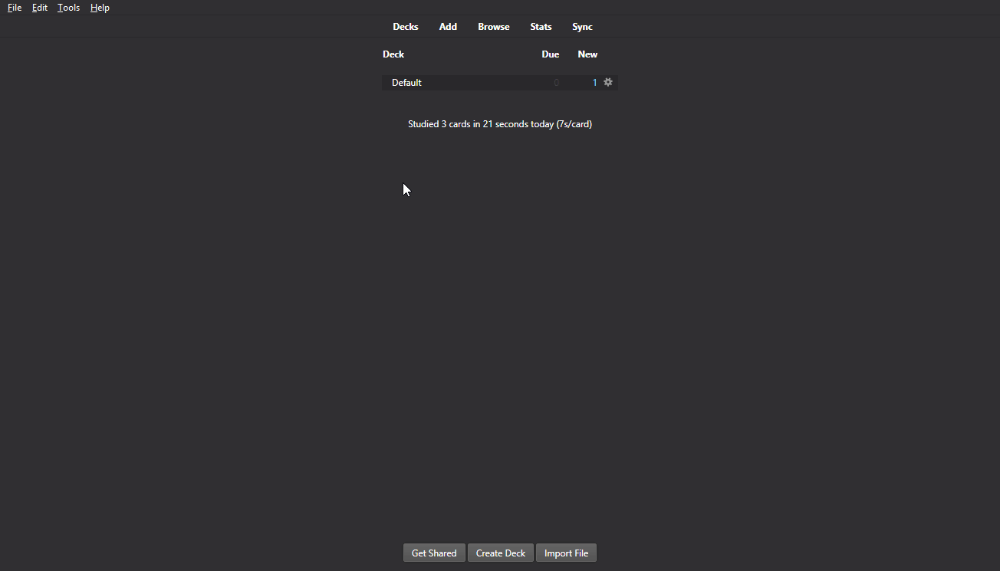

# Word shuffle

> *TLDR;*  
> This addons splits sentences and shuffle its words. Then it lets you fix the word order by dragging/dropping. 

## Motivation

When learning a new language, a common different that we need to get used to, is the word ordering.  
That's the case for creating this add-on, as I (its creator) am learning German. With this add-on, 
I can use Anki to review Deutsche Satzstruktur (German sentences ordering).   

## How it works

It's simple!  
Create a card of type: Cloze Deletion (or something like *Omissão de palavras* - depending on your language). 

> That's a standard Anki feature - the add-on does NOT create a new note type

Just , surround the part of the text that you want to be randomized with the add-on markup: 

> [[ws: Your text here without these dots... ]]

Then, when you access the given card during review, words on the text block will be shown in a shuffled order.  
Each word appears as a small block. Then, you can drag & drop each piece, fixing the order.  

#### With a click

> From 1.1

If you don't want to drag/drop, or to be quicker, you can just click the _next_ word. 
The current position is market with a `>`. Of course, you can still drag/drop to change any position.

#### Feedback

> From 1.1

On _Show Answer_, your order is shown as well (small text below original). 

### Markup 

To add the add-on markup, you can either: 

* use an addional button on Card Editor; or
* Use the shortcut: `Ctrl+Shift+W` 

### Restrictions

* It runs under Anki's rules for cards. Therefore, a note of type _cloze deletion_ needs to have at least 1 cloze deletion field;
* The add-on supports only **plain text** to be processed.  

## Installation / Configuration

Just install it as any standard Anki add-on.  
No configuration is needed.  

## Updates

> Check [RELEASE_NOTES](RELEASE_NOTES.md)

## About

Add-on developed by *ssricardo*.  
Check out more of my add-ons on [Github Anki Plugins](https://github.com/ssricardo/anki-plugins)